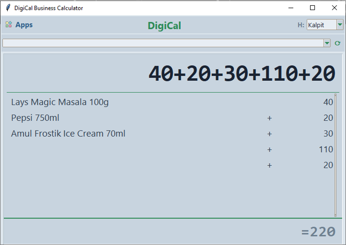
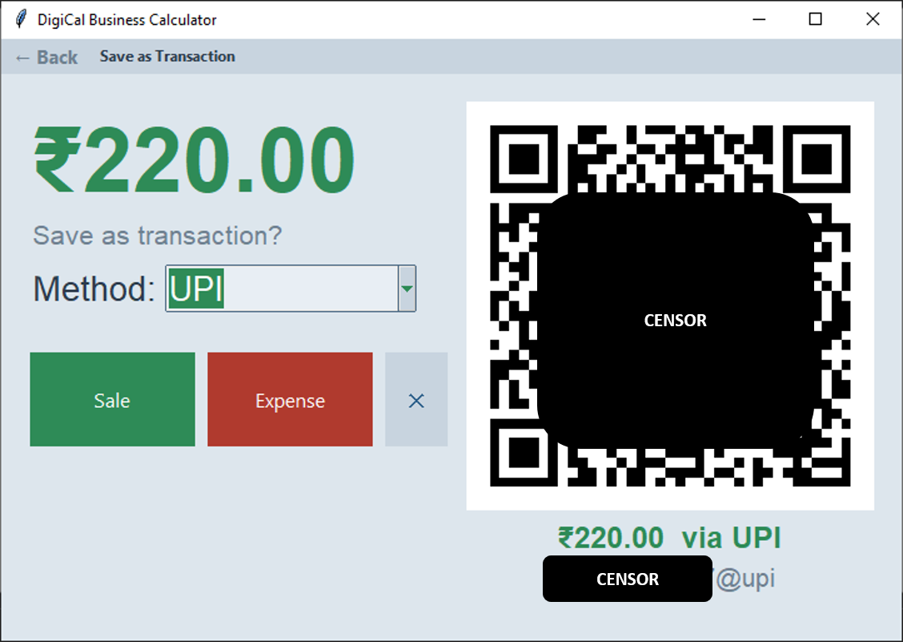
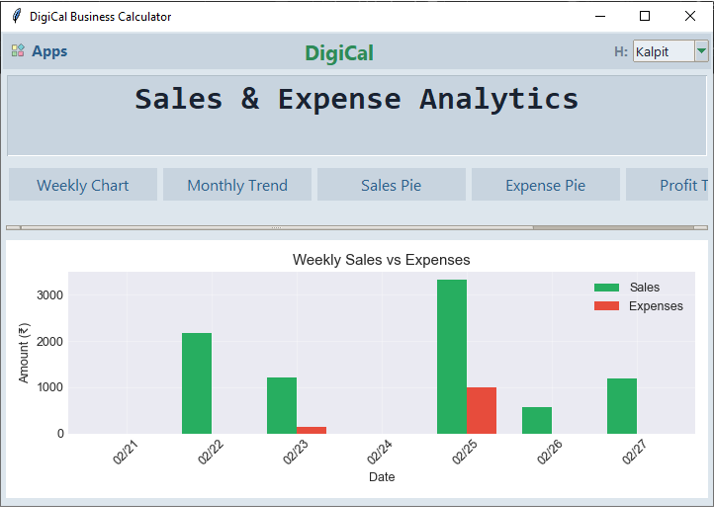
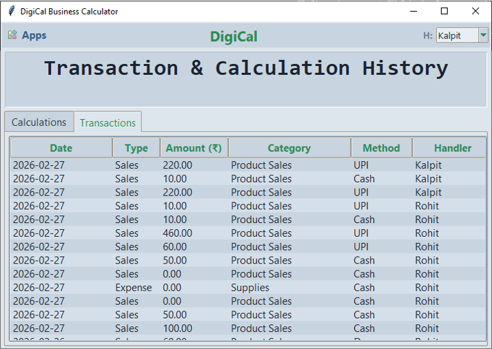

<div align="center">
  
  <h1>DigiCal Business Calculator</h1>
  <p><em>A modern, beautiful, and feature-rich business calculator optimized for desktop and Raspberry Pi</em></p>
  
  [](https://www.python.org/downloads/)
  [](LICENSE)
</div>

<br/>

DigiCal is a comprehensive business calculator and transaction management system. Designed with a stunning neumorphic interface, it goes beyond simple calculations by offering built-in sales and expense tracking, integrated UPI payments, detailed analytics, and a companion Web Portal for remote access.

## ✨ Features

- **🧮 Advanced Calculator**: Standard arithmetic, percentages, and memory functions (M+, M-, MR, MC) with a beautiful dual-line display (live evaluation).
- **💳 Transaction Tracking**: Seamlessly record Sales and Expenses directly from calculator results. Includes categorical breakdown and custom descriptions.
- **📱 UPI QR Payments**: Dynamically generated UPI payment QR codes for easy customer payments directly from the app.
- **📈 Rich Analytics**: Visualized business insights with weekly/monthly trends, profit analysis, and category-wise pie charts.
- **👥 Customer Management**: Track due payments and manage customer balances effectively.
- **📦 Inventory Tracker**: Basic product inventory management with low-stock alerts.
- **🌐 Web Portal**: Live remote access to your business data from your smartphone or another PC on the same network.
- **🌓 Dark/Light Neumorphic UI**: Gorgeous, modern user interface with customizable themes.
- **💾 Data Persistence**: all data is securely stored locally using SQLite.

---

## 📸 Screenshots

*(Add your own screenshots inside the `assets/screenshots/` folder and link them here to showcase the app!)*

<div align="center">
  <table>
    <tr>
        <td align="center">
        <!--  -->
        <br/><b>Calculator Mode</b>
        </td>
        <td align="center">
        <!--  -->
        <br/><b>Sales Entry & UPI</b>
        </td>
    </tr>
    <tr>
        <td align="center">
        <!--  -->
        <br/><b>Visual Analytics</b>
        </td>
        <td align="center">
        <!--  -->
        <br/><b>Transaction History</b>
        </td>
    </tr>
  </table>
</div>

---

## 🚀 Installation & Setup

### Windows / macOS / Linux (Desktop)

1. Clone or download this repository
2. Install Python 3.7 or higher
3. Install dependencies:
   ```bash
   pip install -r requirements.txt
   ```
4. Run the application:
   ```bash
   python digical.py
   ```

### Raspberry Pi Zero 2W (Optimized)

1. Transfer the entire `DigiCal` folder to your Raspberry Pi.
2. SSH into your Raspberry Pi or open a terminal and navigate to the directory:
   ```bash
   cd /path/to/DigiCal
   ```
3. Install dependencies:
   ```bash
   pip3 install -r requirements.txt
   # NOTE: If you face issues with Matplotlib or Pillow, you may need to install system dependencies:
   # sudo apt-get install python3-matplotlib python3-pil python3-pil.imagetk
   ```
4. Run the application:
   ```bash
   python3 digical.py
   ```

---

## 💻 Usage Guide

### 🔢 Calculator Mode
- Use the on-screen buttons or your keyboard (`0-9`, `+`, `-`, `*`, `/`, `Enter`).
- **Live formatting**: See the result of your equation automatically at the bottom right before pressing equals.
- Press `=` to finalize the calculation and trigger the Transaction save prompt.

### 💰 Saving Transactions
- After calculating an amount, the app will ask if you want to save it.
- Choose **Sale** or **Expense**.
- Select the Payment Method (**Cash**, **UPI**, or **Due**).
- *If UPI is selected*, a scannable QR code will be generated on-screen based on your configured UPI ID in Settings.

### 📊 Web Portal
- When you run DigiCal, the API server starts automatically.
- Look at the console output for the local URL (e.g., `http://192.168.x.x:8126`).
- Open this URL on your phone or another computer on the same network to view live sales and expenses remotely!

---

## 🛠️ Configuration

You can customize the app by editing `config.py` or using the built-in **Settings** UI inside the app:
- **UPI Details**: Set your UPI Number and Name for QR generation.
- **Theme**: Toggle between Light and Dark mode.
- **Categories**: Modify the default Expense, Sales, and Product categories.
- **Dimensions**: Adjust `WINDOW_WIDTH` and `WINDOW_HEIGHT` for different screen sizes.

---

## 📁 File Structure

```text
DigiCal/
├── digical.py              # Main application entry point (GUI + Web API)
├── gui.py                  # Tkinter UI implementation
├── api.py                  # Flask Web Portal server
├── calculator.py           # Core math logic
├── transaction_manager.py  # Sales & Expense processing
├── history_manager.py      # History logging
├── graph_generator.py      # Matplotlib data visualization
├── handler_manager.py      # Employee/Handler commission logic
├── database.py             # SQLite DB operations
├── config.py               # Application settings
├── requirements.txt        # Python dependencies
└── assets/                 # Icons, GIFs, and images
```

---

## ⚙️ Troubleshooting

- **QR Code not generating**: Ensure `qrcode` is installed (`pip install qrcode[pil]`).
- **Web Portal not loading**: Ensure Python is allowed through your firewall, and your phone is on the same WiFi network.
- **Database Errors**: If the database gets corrupted, delete `digical.db` and restart the app to generate a fresh one.

---

<div align="center">
  <p>Built with ❤️ by Kalpit</p>
</div>
