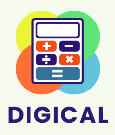
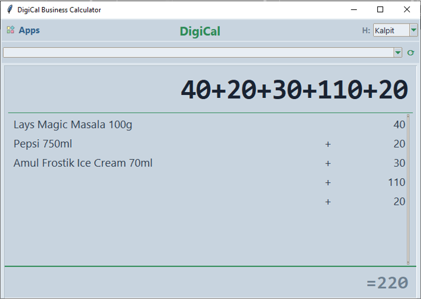
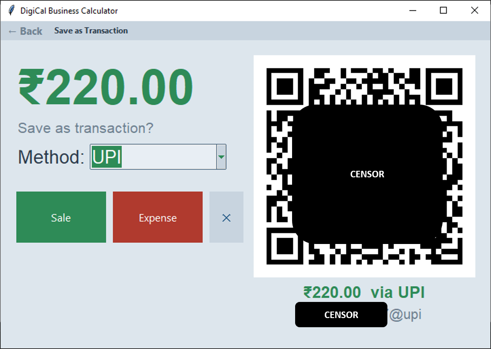
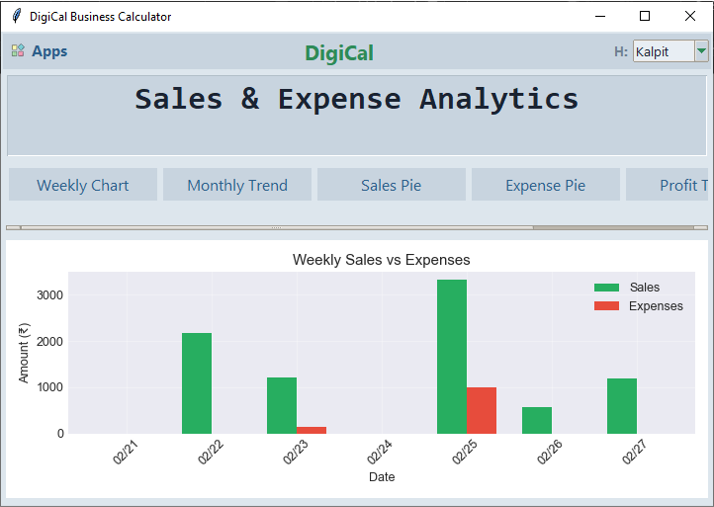
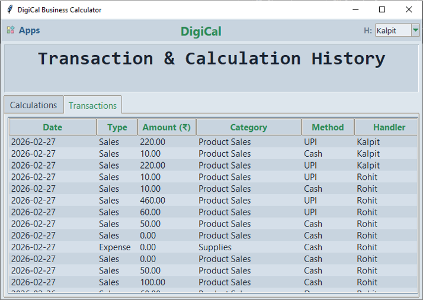

<div align="center">



<br/>

# DigiCal: Smart Business Calculator

**A modern, feature-rich business calculator & transaction management system**  
*Built with a stunning neumorphic interface — optimized for Raspberry Pi Zero 2W

<br/>

[](https://www.python.org/)
[](LICENSE)
[]()
[]()
[]()

<br/>

[🚀 Get Started](#-installation) · [✨ Features](#-features) · [📖 Usage](#-usage-guide) · [🌐 Web Portal](#-web-portal) · [🛠️ Config](#️-configuration)

<br/>

</div>

---

## ✨ Features

<br/>

| | Feature | Description |
|---|---|---|
| 🧮 | **Advanced Calculator** | Standard arithmetic, percentages, and memory functions (M+, M−, MR, MC) |
| 💳 | **Transaction Tracking** | Record Sales & Expenses directly from results with categorical breakdown and custom descriptions |
| 📱 | **UPI QR Payments** | Dynamically generated UPI payment QR codes for instant customer payments |
| 📈 | **Rich Analytics** | Visual business insights — weekly/monthly trends, profit analysis, and category-wise pie charts |
| 👥 | **Customer Management** | Track due payments and manage customer balances effectively |
| 📦 | **Inventory Tracker** | Product inventory management with low-stock alerts |
| 🌐 | **Web Portal** | Live remote access to business data from your phone or PC on the same network |
| 🌓 | **Neumorphic UI** | Gorgeous dark/light neumorphic interface with customizable themes |
| 💾 | **Local Data Persistence** | All data stored securely and locally via SQLite — no cloud, no subscription |

<br/>

---

## 📸 Screenshots

<br/>

<div align="center">
<table>
  <tr>
    <td align="center">
      <br/>
      <sub><b>Calculator Mode</b></sub>
    </td>
    <td align="center">
      <br/>
      <sub><b>Dynamic UPI QR</b></sub>
    </td>
  </tr>
  <tr>
    <td align="center">
      <br/>
      <sub><b>Visual Analytics</b></sub>
    </td>
    <td align="center">
      <br/>
      <sub><b>Transaction History</b></sub>
    </td>
  </tr>
</table>
</div>

<br/>

---

## 🚀 Installation

<br/>

### 🖥️ Windows / macOS / Linux

```bash
# 1. Clone the repository
git clone https://github.com/your-username/DigiCal.git
cd DigiCal

# 2. Install dependencies
pip install -r requirements.txt

# 3. Launch DigiCal
python digical.py
```

<br/>

### 🍓 Raspberry Pi Zero 2W

```bash
# 1. Navigate to the DigiCal directory
cd /path/to/DigiCal

# 2. Install Python dependencies
pip3 install -r requirements.txt

# NOTE: If Matplotlib or Pillow fail, install via system packages:
sudo apt-get install python3-matplotlib python3-pil python3-pil.imagetk

# 3. Run the app
python3 digical.py
```

> **Tip:** DigiCal is specifically optimized for the Raspberry Pi's 3.5" touchscreen display. Adjust `WINDOW_WIDTH` and `WINDOW_HEIGHT` in `config.py` for your screen.

<br/>

---

## 📖 Usage Guide

<br/>

### 🔢 Calculator Mode

- Use the **on-screen buttons** or your **keyboard** (`0–9`, `+`, `-`, `*`, `/`, `Enter`)
- **Live preview** — the result of your equation appears at the bottom-right before pressing `=`
- Press `=` to finalize and trigger the **Transaction save prompt**

<br/>

### 💰 Saving a Transaction

After calculating an amount, a prompt will appear:

```
1. Choose type     →   [ Sale ]  or  [ Expense ]
2. Pick method     →   [ Cash ]  or  [ UPI ]  or  [ Due ]
3. Add description →   (optional, for your records)
```

<br/>

### 📱 UPI QR Code

When **UPI** is selected as the payment method, a scannable QR code is instantly generated on-screen based on your configured UPI ID — customers can pay in seconds.

<br/>

### 🌐 Web Portal

When DigiCal starts, the Flask API server launches automatically.

```
✅ Server started at  →  http://192.168.x.x:8126
```

Open this URL on any device on the **same WiFi network** to view live sales, expenses, and analytics remotely from your smartphone or another computer.

<br/>

---

## 🛠️ Configuration

Customize via `config.py` or the built-in **Settings UI** inside the app:

<br/>

| Setting | Description |
|---|---|
| **UPI Details** | Set your UPI ID and merchant name for QR code generation |
| **Theme** | Toggle between Light and Dark neumorphic mode |
| **Categories** | Modify default Expense, Sales, and Product categories |
| **Dimensions** | Adjust `WINDOW_WIDTH` / `WINDOW_HEIGHT` for your display |

<br/>

---

## 📁 File Structure

```
DigiCal/
├── digical.py              # 🚀 Main entry point (GUI + Web API)
├── gui.py                  # 🎨 Tkinter UI implementation
├── api.py                  # 🌐 Flask Web Portal server
├── calculator.py           # 🧮 Core math logic
├── transaction_manager.py  # 💳 Sales & Expense processing
├── history_manager.py      # 🕓 History logging
├── graph_generator.py      # 📊 Matplotlib data visualization
├── handler_manager.py      # 👤 Employee/Handler commission logic
├── database.py             # 🗄️  SQLite DB operations
├── config.py               # ⚙️  Application settings
├── requirements.txt        # 📦 Python dependencies
└── assets/                 # 🖼️  Icons, GIFs, and images
```

<br/>

---

## ⚙️ Troubleshooting

<br/>

<details>
<summary><b>📷 QR Code not generating</b></summary>
<br/>
Ensure <code>qrcode</code> is installed with Pillow support:

```bash
pip install qrcode[pil]
```

Then restart the application.
</details>

<details>
<summary><b>🌐 Web Portal not loading on phone</b></summary>
<br/>

- Ensure Python/Flask is allowed through your firewall
- Confirm your phone and the host PC are on the **same WiFi network**
- Check the console for the correct local IP address
</details>

<details>
<summary><b>🗄️ Database errors or corruption</b></summary>
<br/>

Delete the database file and let DigiCal regenerate it fresh:

```bash
rm digical.db
python digical.py
```

> ⚠️ This will erase all stored transaction data.
</details>

<details>
<summary><b>🍓 Matplotlib issues on Raspberry Pi</b></summary>
<br/>

Install system-level packages instead of pip:

```bash
sudo apt-get install python3-matplotlib python3-pil python3-pil.imagetk
```
</details>

<br/>

---

## 📦 Dependencies

```
tkinter        # GUI framework (built-in with Python)
flask          # Web Portal API server
matplotlib     # Analytics charts & graphs
pillow         # Image processing & QR display
qrcode[pil]    # UPI QR code generation
sqlite3        # Local database (built-in with Python)
```

Install all at once:
```bash
pip install -r requirements.txt
```

<br/>

---

<div align="center">

<br/>

**Built with ❤️ by Kalpit**

*DigiCal - Smart Business Calculator*

[](https://www.python.org/)
[](https://www.sqlite.org/)
[](https://flask.palletsprojects.com/)

<br/>

</div>